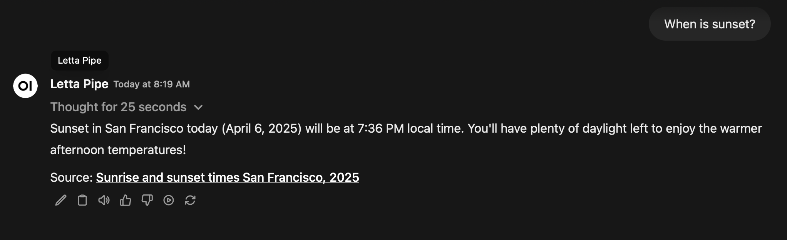
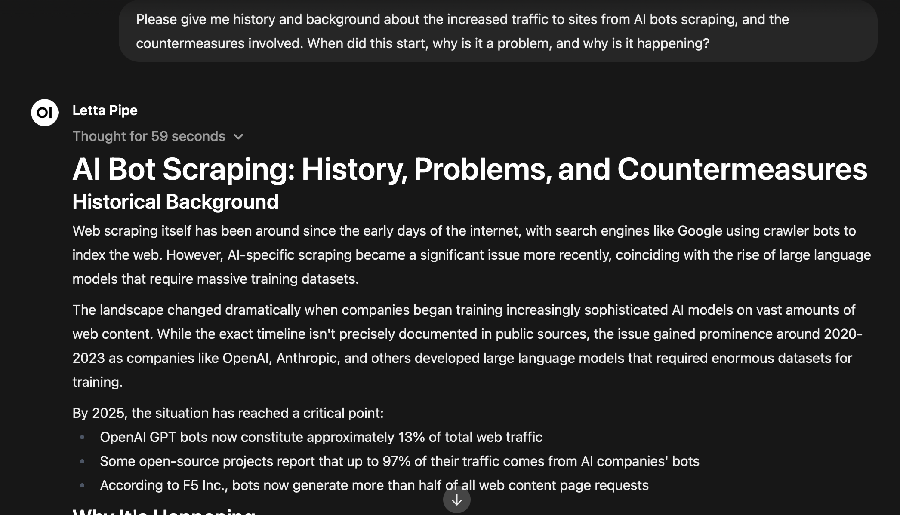
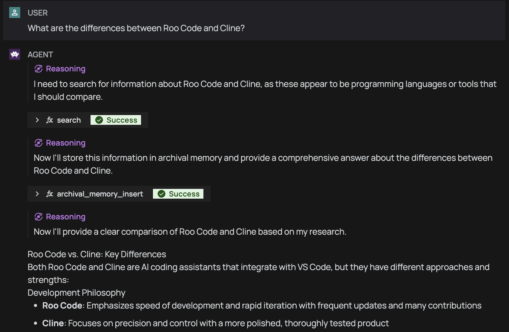
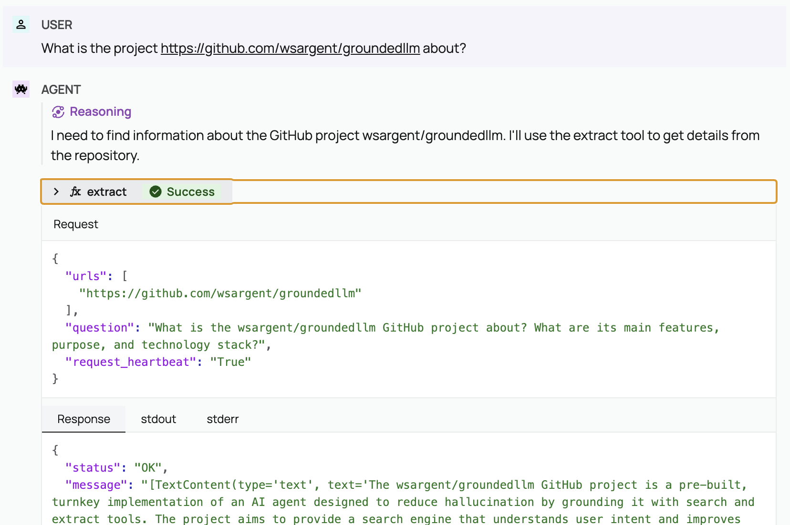
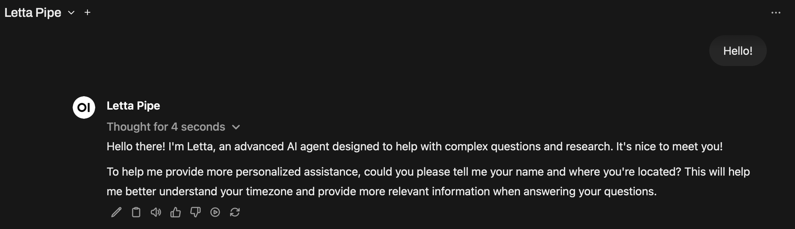

# GroundedLLM

This is a pre-built, turnkey implementation of an AI agent grounded with search, excerpt, and extract tools to reduce hallucination and provide correct and complete answers to questions.  Jina has an [excellent blog post](https://jina.ai/news/a-practical-guide-to-implementing-deepsearch-deepresearch) on the details.

If you have the API keys and Docker Compose, you should be able to go to http://localhost:3000 and have it Just Work.  It runs fine on a Macbook Air with 8 GB memory.

[SearXNG](https://docs.searxng.org) is included as the search engine by default, but I recommend you set up one of the included Search APIs and use those, as they claim to have higher quality search results.

There are several options available for chat models -- in practice you're using OpenAI, Anthropic, or Gemini for the search agent, as open weight models still do far worse on the [Letta leaderboard](https://docs.letta.com/leaderboard).  However, even if you use a paid model from Anthropic or OpenAI, it's more cost effective to use the API directly compared to the $20 a month for Claude Pro or ChatGPT Plus, and you can get more functionality by going direct to the API.

## Who's Interested?

This project may be of interest to you if:

* **You don't want to mess around.**  You want a search engine that knows what you want and gets smarter over time with very little effort on your part, and if that means you wait for 30 seconds to get the right answer, you're okay with that.
* **You are interested in AI agents.** This project is a low effort way to play with [Letta](https://docs.letta.com/letta-platform), and see a [stateful agent](https://docs.letta.com/stateful-agents) that can remember and learn.
* **You are interested in RAG pipelines.**  [Haystack](https://haystack.deepset.ai/) toolkit has several options to deal with document conversion, cleaning, and extraction.  The search and extract tools plug into these.
* **You're interested in [Open WebUI](https://github.com/open-webui/open-webui).** You shouldn't need to use a different UI when you ask questions that require searching.  Open WebUI is powerful and popular, so let's keep using that.

## Description

This project helps ground your LLM from hallucination by providing it with search and page extraction tools and the ability to remember things through [Letta](https://docs.letta.com/letta-platform), an agent framework with memory and tool capabilities.  Every time it searches or extracts a web page, it will save a summary of the search and the results into archival memory, and can refer back to them.

Because a Letta agent is a stateful agent, it doesn't matter if you bring up a new chat.  The agent will continue the conversation from where you left off and remembers details (like your name and location) so that it can answer new questions.



Because a Letta agent has memory, it is teachable.  If you tell it your location, it will not only sort out timezone and locale for all subsequent queries, but it can also learn your preferences, websites to avoid, and even pick up new strategies for searching.  

The main advantage of an agent is that it's capable of recognizing and acting when a tool has not returned the correct results.  Letta will dig down into search results if it thinks it's not detailed enough.  For example, it performed three searches in response to the question "Please give me history and background about the increased traffic to sites from AI bots scraping, and the countermeasures involved.  When did this start, why is it a problem, and why is it happening?"

* "History and background of increased web traffic from AI bots scraping websites, when it started becoming a major issue, why it's a problem, and why it's happening. Include information about countermeasures websites use against AI scraping."
* "When did AI bots scraping websites first become a significant issue? What specific countermeasures have websites implemented against AI scraping bots? Include historical timeline and details about robots.txt, legal cases, and technical measures."
* "What are the major legal cases about AI web scraping from 2020-2025? When did companies like OpenAI and Anthropic start large-scale web scraping for training AI models?"

And produced this:



If you want more details on what it's thinking, you can dig into the reasoning using [Letta Desktop](https://docs.letta.com/quickstart/desktop).  Here's an example of what goes on behind the scenes when I ask "What are the differences between [Roo Code](https://docs.roocode.com) and [Cline](https://github.com/cline/cline)?"



In addition to search, Letta can also extract content from specific URLs.  For example:



This is useful when the search engine hasn't picked up information on the pages.

## Getting Started

You will need [Docker Compose](https://docs.docker.com/compose/install/) set up, and you will need API access to a frontier (OpenAI/Anthropic/Gemini) model.

If you do not have these accounts or API keys, it is *very* simple to set them up if you have a Google or Github account.  Gemini will ask you to sign in with your Google account, then give you a free key.  If you want to upgrade, you can set up a  [billing account](https://ai.google.dev/gemini-api/docs/billing) for PAYG.  Tavily is the same way; there's no [credit card required](https://docs.tavily.com/documentation/api-credits) and PAYG is opt in.

To configure the API keys, start by creating an `.env` file from the `env.example` file:

```
cp env.example .env
# edit .env file with your own API keys.
```

### Gemini Config

If you want to use Google AI Gemini models, you will need a [Gemini API key](https://ai.google.dev/gemini-api/docs/api-key).

```
GEMINI_API_KEY=...

LETTA_CHAT_MODEL=google_ai/gemini-2.5-flash-preview-05-20

HAYHOOKS_SEARCH_MODEL=gemini/gemini-2.0-flash
HAYHOOKS_EXCERPT_MODEL=gemini/gemini-2.0-flash
HAYHOOKS_SEARCH_EMAIL_MODEL=gemini/gemini-2.0-flash
```

Note that Gemini's privacy policy may be an issue if you are using the gmail/gcalendar integration (privacy policies are at the end of this document).

### Anthropic Config

If you want to use Claude Sonnet 4, you'll want an [Anthropic API Key](https://console.anthropic.com/settings/keys).

```
ANTHROPIC_API_KEY=...

LETTA_CHAT_MODEL=anthropic/claude-sonnet-4-20250514

HAYHOOKS_EXCERPT_MODEL=anthropic/claude-3-5-haiku-latest
HAYHOOKS_SEARCH_MODEL=anthropic/claude-3-5-haiku-latest
HAYHOOKS_SEARCH_EMAIL_MODEL=anthropic/claude-3-5-haiku-latest
```

### OpenAI Config

If you want to use OpenAI, you'll want an [OpenAI API Key](https://platform.openai.com/api-keys).

```
OPENAI_API_KEY=...

LETTA_CHAT_MODEL=openai/gpt-4.1
HAYHOOKS_EXCERPT_MODEL=openai/gpt-4o-mini
HAYHOOKS_SEARCH_MODEL=openai/gpt-4o-mini
HAYHOOKS_SEARCH_EMAIL_MODEL=openai/gpt-4o-mini
```

### OpenRouter Config

If you want a cheaper option for summarization, you can configure LiteLLM to use [OpenRouter](https://openrouter.ai) or [Requesty](https://www.requesty.ai) and use an appropriate model with long context from the list -- [Llama 4 Scout](https://openrouter.ai/meta-llama/llama-4-scout) is a good option.  I do not recommend using Deepseek or Qwen due to [privacy concerns](https://www.thefirewall-blog.com/2025/03/privacy-pitfalls-in-ai-a-closer-look-at-deepseek-and-qwen/).

You will want to look at Letta's [OpenAI compatible](https://docs.letta.com/guides/server/providers/openai-proxy) settings and edit the docker-compose.yml to set up the Letta container `OPENAI_API_BASE="https://openrouter.ai/api/v1"`, as setting up openrouter through LiteLLM to Letta is very unlikely to work:

```
OPENROUTER_API_KEY=...

# set through openai-compatible endpoint
LETTA_CHAT_MODEL=anthropic/claude-sonnet-4

HAYHOOKS_EXCERPT_MODEL=openrouter/meta-llama/llama-4-scout
HAYHOOKS_SEARCH_MODEL=openrouter/meta-llama/llama-4-scout
HAYHOOKS_SEARCH_EMAIL_MODEL=openrouter/meta-llama/llama-4-scout
```

### Search Engine Configuration

SearXNG comes for free out of the box, but I recommend disabling SearXNG and going with one of the following search APIs that may produce better results:

* [Linkup API key](https://app.linkup.so/home) -- you get [5 euros every month](https://docs.linkup.so/pages/documentation/development/pricing).
* [Tavily API key](https://app.tavily.com/home) -- free up to 1000 searches, pay as you go (PAYG) is 8 cents per 1000 searches.
* [Exa API key](https://app.linkup.so/home) -- you get [$10 total](https://exa.ai/pricing?tab=api) when you open your account.
* [Brave API key](https://api-dashboard.search.brave.com/app/keys) -- free is 1 rps, 2k requests a month.
* [Jina API key](https://jina.ai/api-dashboard/key-manager) -- free, there's a limited number of tokens.

If none of these work for you, there is a full list of options [here](https://www.mattcollins.net/web-search-apis-for-llms), and writing another web search integration is very easy to do.

## Starting It Up

To start the services, run the following:

```bash
docker compose up
```

You will see a bunch of text in the logs, but the important bit is this line:

```
initializer  | 2025-04-06 14:29:00,484 - INFO - Initialization complete!
```

(If you don't see this, it's probably a bug.  [File an issue](https://github.com/wsargent/groundedllm/issues/new) and copy and paste the logs into the issue.)

When you see that, you should be good to go.  Open a browser at http://localhost:3000 and type in "hello."



## Working with Letta

The first thing you'll want to do is tell Letta your name, timezone, and location -- this will help it understand who, when, and where you are.

After that, you will want to give it preferences, using the phrase "store this in your core memory" so that it can remember it for later.

Some example preferences:

* I like mermaid diagrams for visualizing technical concepts and relationships.
* I am using Haystack 2.12, please specify 2.x when searching for Haystack docs.
* Only give me sample code examples when I explicitly ask you to.
* Show me inline images when you provide results from Wikipedia pages.
* Avoid sycophancy: don't tell me I've asked an insightful or deep question or compliment me.

Because Letta doesn't always store conversations in archival memory, you also want to ask it to explicitly summarize and store the conversation when you're changing topics.  This lets you take notes and store bookmarks when you want to bring up an old topic for later.

Grounding with search can reduce hallucinations, but *will not eliminate them*.  You will still need to check the sources and validate that what Letta is telling you is accurate, especially if you are doing anything critical.  Also, do your own searches!  Search engines are free for humans, and Letta will be happy to give you its reference material.

## Management

When you want it to run in the background, you can run it as a daemon:

```bash
docker compose up -d
```

To rebuild a container (probably Hayhooks or a new MCP container you're adding):

```
docker compose up --build 'hayhooks'
```

To rebuild everything, use:

```
docker compose up --build
```

To completely destroy all resources (including all your data!) and rebuild from scratch:

```bash
docker compose down -v --remove-orphans && docker compose up --build
```

If you want to modify functionality, see the Hayhooks [README](./hayhooks/README.md).

## Optional Integrations

Awkwardly, this project has grown past the boundaries of being a "grounded" LLM and has started sprouting.  None of these integrations are required, but they do make it much easier to find things if you are an extremely lazy person like me.

### Google Calendar and Email

You can give the search agent access to your Google Calendar and Mail.  This does require you to create a Google Cloud project, details are in the [Hayhooks README.md](hayhooks/README.md).

Once you have a project set up, you can authenticate either by going to https://localhost:1416 and clicking through, or just asking the agent to check your authentication status.

If you hand the agent a gmail or gcal URL it can extract it for you.

### Youtube Transcript Integration

If you give the search agent a Youtube URL i.e. https://www.youtube.com/watch?v=l-9ALe3U-Fg then it will extract the transcript and can summarize the contents for you.

### Zotero Integration

If you use Zotero, you can give the agent access to your repository by adding the [keys](https://www.zotero.org/settings/keys) and setting `ZOTERO_LIBRARY_ID` and `ZOTERO_API_KEY` environment variables in `.env`.  You can search for pretty much anything, but it doesn't do wildcard matches.

Passing the agent a Zotero URL like `zotero://select/items/7WI4QKGX` will search the repository, or a DOI link `https://doi.org/10.1098/rstb.2016.0007` that corresponds to a local document will also go through content extraction.  You can use this to compare many PDFs at once using the excerpt model, which will then summarize it to the agent.

### Stack Overflow Integration

The agent is capable of searching [Stack Overflow](http://stackoverflow.com) using the API, searching for the error and finding the most accepted answers.

### Notion Integration

If you use [Notion](http://notion.so), you can integrate it with the agent through a [custom connection](https://developers.notion.com/docs/create-a-notion-integration#create-your-integration-in-notion).  You need to pick a database and use the "Connections" dropdown to select your integration, and then set `NOTION_API_KEY` in your `.env` file.

If you give the agent a Notion URL, it can extract or excerpt the contents for you. There is no search integration right now.

### Github Integration

If you use Github, you can create a [personal access token](https://docs.github.com/en/authentication/keeping-your-account-and-data-secure/managing-your-personal-access-tokens) and set it to `GITHUB_API_TOKEN` environment variable -- this will enable the extract and excerpt tools to read private Github issues and repositories if you pass in the URL, and will also give you higher rate limits.

### Customizable Content Extraction

If the URL is not recognized as "special" (Github, Notion, etc), then Hayhooks will try to fetch content using a content fetcher.   Some URLs are on websites that have complex page structure or special hoops to jump through: you can use the `ContentFetcherResolver` to map URL patterns and domains to particular fetchers.  

There are three possible fetchers, but only the default is set up out of the box:

* The default `HaystackLinkContentFetcher`, which uses [LinkContentFetcher](https://docs.haystack.deepset.ai/docs/linkcontentfetcher).
* `ScraplingLinkContentFetcher`, which uses [Scrapling](https://scrapling.readthedocs.io/en/latest/) and can be configured with a headless browser for dynamic sites.
* `JinaLinkContentFetcher` which uses [Jina Reader](https://jina.ai/reader/).

You must run `scrapling install` to install the browser and libraries, so right now it just uses the basic `Fetcher` which does not use a headless browser.

## Composition

The docker compose file integrates several key components:

* **Open WebUI:** A user-friendly front-end interface 
* **Letta:** An agent framework with built-in memory and tooling capabilities.
* **Hayhooks:** A tool server for use by Letta.
* **LiteLLM Proxy Server:**  Makes all providers "OpenAI style" for Hayhooks.

Note that if you delete or rename the Letta agent, the initializer will provision a new one with the same name automatically.

### Open WebUI

[Open WebUI](https://docs.openwebui.com) is the standard for front end interfaces to LLMs and AIs in general.

There are a number of tweaks to [improve performance](https://docs.openwebui.com/tutorials/tips/improve-performance-local) and minimize the time to get started.

For example, this instance is configured to use Gemini embedding so that it doesn't download 900MB of embedding model for its local RAG.  You can configure it to use `nomic-embed-text` through Ollama if you want a local embedding model.

It is not possible to upload files into Letta through the Open WebUI interface right now.  The functionality does exist in Letta through the [data sources](https://docs.letta.com/guides/agents/sources) feature, but it might be easier to use a OWUI plugin to send it to Hayhooks and keep it in a document store.

As Hayhooks is an [OpenAPI server](https://docs.openwebui.com/openapi-servers/), you can use the Hayhooks tools directly in *any* model in Open WebUI directly through the Tools setting and adding `http://hayhooks:1416` as a connection.  You do *not* need to use MCPO or configure MCP in Open WebUI.   Using tools directly is very useful when the model is not "Letta capable" or you don't want the model making multiple tool calls.

### Letta

[Letta](https://docs.letta.com) is an agent framework that has built-in self editing memory and built-in tooling for editing the behavior of the agent, including adding new tools.

The search technique is pulled from this academic paper on [DeepRAG](https://arxiv.org/abs/2502.01142), although [query decomposition](https://haystack.deepset.ai/blog/query-decomposition) is a well known technique in general.  If you want a classic deep learning style agent, you can import one from Letta's [agent-file git repository](https://github.com/letta-ai/agent-file/tree/main/deep_research_agent).

#### Picking a Model Provider

Letta requires models that have a [minimum amount of complexity](https://tersesystems.com/blog/2025/03/07/llm-complexity-and-pricing/) and will not work reliably with smaller models.  Check the [Letta Leaderboard](https://docs.letta.com/leaderboard) to see what models do the best and worst.

When using local models, I've had the best luck with the Gemma3 models at or above 12B.  If you want to be experimental, try [Google Cloud Run](https://cloud.google.com/run/docs/tutorials/gpu-gemma-with-ollama) which will give you $300 in credits or the free [Openrouter](https://openrouter.ai/google/gemma-3-27b-it:free) models.

#### Letta Desktop

You may want Letta Desktop, which will allow you to see what the agent is doing under the hood, and directly edit the functionality. You can download it [here](https://docs.letta.com/quickstart/desktop).  Pick the PostgreSQL option when it comes up.

Start the docker compose app *first* and *then* open up Letta Desktop, as it is connecting to the Letta agent running inside the container.

### Hayhooks

[Hayhooks](https://github.com/deepset-ai/hayhooks/) is a FastAPI-based server that exposes [Haystack Pipelines](https://docs.haystack.deepset.ai/docs/intro) through REST APIs.  It's great for processing content and providing a simple interface to Letta.  

Hayhooks fills multiple roles that make it very useful:

* Hayhooks exposes Letta agents as an OpenAI-compatable endpoint to Open WebUI.
* Hayhooks is an MCP server, so tools are available to Cline / Claude Code, etc.
* Hayhooks is an OpenAPI server, so tools are available to Open WebUI.
* Hayhooks is an HTTP server, so it is an endpoint for Google's OAuth 2 authentication.
* Hayhooks has access to Haystack's rich functionality, including calling LLMs for filtering and processing.

The primary focus is on search, excerpt (aka answering), and extraction.

In the case of search and excerpt, the tools use Google Flash 2.0 to process the search output and run searches through cheaper models to ameliorate Anthropic's brutally low rate limits and higher costs.  Unlike Letta, Hayhooks is very flexible about the models it uses, and you can swap to other models if that works better for you.

The search tool extracts the full text of each search result and adds it as context to a long context search model following [search best practices](https://docs.tavily.com/documentation/best-practices/best-practices-search).  It also recommends possible follow up queries and [query expansion](https://haystack.deepset.ai/blog/query-expansion) along with the search results.

The excerpt tool does content extraction like the extract tool, but sends it to a long context model which will answer the question given to it by Letta, using the provided context.  This is useful when there's a small amount of focused data that's inside many URLs.

The extract tool converts a single web page to Markdown and does some document cleanup before sending it directly to Letta.  The content extraction is internal to Haystack and comes for free.  It does not attempt any kind of bot evasion.  There is a fallback option to use [Jina Reader](https://github.com/jina-ai/reader) if the internal content extraction fails.

There is no vector/embeddings/database RAG involved in this project, although you have the option to use your own by plugging it into Hayhooks.  In addition, Letta's archival memory is technically a RAG implementation based on pgvector.

See the [README](./hayhooks/README.md) for details of the tools provided by Hayhooks.

### LiteLLM Proxy Server

The [LiteLLM proxy server](https://docs.litellm.ai/docs/proxy/deploy) that provides an OpenAI compatible layer on top of several different providers. It is provided to Open WebUI (commented out) and to Hayhooks.

LiteLLM is mostly commented out here to focus attention on Letta.  However, it is very useful in general, especially as you scale up in complexity, and I think it's easier if you start using it from the beginning.

* It provides a way to point to a conceptual model rather than a concrete one (you can point to "claude-sonnet" and change the model from 3.5 to 3.7).  
* It insulates Open WebUI from the underlying providers.  You don't have to worry about changing your API key or other configuration settings when switching providers.  You also don't have to worry about Open WebUI timing out for 30 seconds while it tries to reach an unreachable provider.
* It lets you specify the same model with different parameters, so you can use `extra-headers` to experiment with [token-efficient tool use](https://docs.anthropic.com/en/docs/build-with-claude/tool-use/token-efficient-tool-use), for example.

## Privacy Concerns

Since you're using this for search, you may want to know how your queries are processed.

Every search company and every model provider has its own privacy policy, some clearer than others.

### Linkup

Linkup's [privacy policy](https://linkup-platform.notion.site/Linkup-Privacy-Policy-197161ecef69800287c9cfca4bf1d39d).  It's a French company, so it's under GDPR.

### Tavily

Tavily's [privacy policy](https://tavily.com/privacy) is that they do store queries, and they will use queries to improve the quality of their services.  You can opt out through the [account settings](https://app.tavily.com/account/settings).

### Exa

Exa's [privacy policy](https://exa.ai/privacy-policy).  They do say "Query data may be used to improve our services." and "We do not treat query data as personal data for privacy law compliance purposes, Any personal information voluntarily submitted through query fields will be processed according to this policy but without additional safeguards specific to personal data."

### Brave

Brave's [privacy policy](https://api-dashboard.search.brave.com/privacy-policy) records all queries for 90 days for troubleshooting and billing purposes.  They are fairly well-known for their strong privacy stance.

### Google

Google's [privacy policy](https://support.google.com/gemini/answer/13594961) states that your conversations with Gemini may be used to improve and develop their products and services, including machine learning technologies.  The [Gemini Pricing](https://ai.google.dev/gemini-api/docs/pricing) page says the free tier does your conversations to train their models. They do use human reviewers and there is a note saying **Please don’t enter confidential information in your conversations or any data you wouldn’t want a reviewer to see or Google to use to improve our products, services, and machine-learning technologies.**  This might be an issue for you if you are using the Gmail or Google Calendar integrations.

### Anthropic

Anthropic's [privacy policy](https://www.anthropic.com/legal/privacy) is clear: they do not use personal data for model training [without explicit consent](https://privacy.anthropic.com/en/articles/10023580-is-my-data-used-for-model-training).

### OpenAI

OpenAI's [privacy policy](https://openai.com/policies/privacy-policy/): data submitted via OpenAI's API is not used to train models unless you explicitly opt in.  Data submitted through the API is retained for 30 days for abuse monitoring and then deleted, unless longer retention is required by law.

### Jina

Jina's [privacy policy](https://jina.ai/legal#privacy-policy).  They are a German company, so GDPR applies.

## Other Options?

I am specifically interested in research agents -- chat interfaces with search attached, rather than search interfaces with chat attached.  I am also not including things like [duck.ai](https://duck.ai) that have chat, but do not attach to the search engine.

I have not researched these deeply, but this gives you an idea of what I'm going for.

### Self Hosted

* [Khoj](https://docs.khoj.dev) has a self-hosting option and appears pretty sane.
* [Perplexica](https://github.com/ItzCrazyKns/Perplexica) uses SearXNG and a reranker to feed into an LLM.
* [Surfsense](https://github.com/MODSetter/SurfSense) is an OSS DeepResearch project that can use personal sources of data.
* [Deer-Flow](https://deerflow.tech) is a self-hosted deep research tool using Tavily.  It produces *long* reports.
* [Morphic](https://www.morphic.sh) is an OSS project on [github](https://github.com/miurla/morphic) that can use Tavily, SearXNG, or Exa.
* [local-deep-research](https://github.com/LearningCircuit/local-deep-research) is an open-source AI research assistant that performs systematic research by breaking down complex questions, searching multiple sources in parallel, and creating comprehensive reports with proper citations. It can run entirely locally for complete privacy.

### Cloud

* [Jina Search](https://search.jina.ai) seems pretty good but it will chew through tokens very fast.
* [Phind](https://www.phind.com) is more chat oriented and has good diagrams.
* [Tak](https://tak.phospho.ai) is another chat oriented search engine, powered by [Linkup](https://www.linkup.so/blog/linkup-phospho-partnership).
* [Morphic](https://www.morphic.sh) also has a free hosted option.

I do not recommend Perplexity due to their [stance on targeted advertising](https://techcrunch.com/2025/04/24/perplexity-ceo-says-its-browser-will-track-everything-users-do-online-to-sell-hyper-personalized-ads/).  

