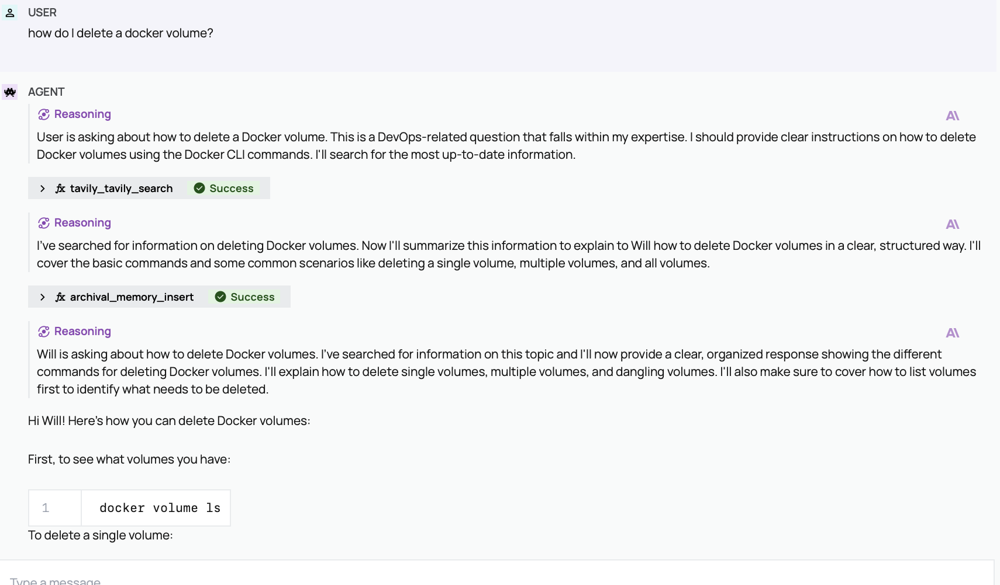

# GroundedLLM

This project makes Claude or ChatGPT (large language models or LLM) dramatically more useful, by [grounding](https://ai.google.dev/gemini-api/docs/grounding?lang=python) your LLM through Letta, an agent with memory and tooling capabilities.  

Grounding the LLM will reduce hallucination and make your LLM more robust and thoughtful.  Here's an example of what goes on behind the scenes when I ask "How do I delete a docker volume?"



This is a pre-built solution.  If you have the API keys and Docker Compose, you should be able to go to http://localhost:3000 and have it Just Work.

There is no vector/embeddings/database RAG involved in this package, although you have the option to use your own by plugging it into Hayhooks.

The docker compose file integrates several key components:

* **Open WebUI:** A user-friendly front-end interface 
* **Letta:** An agent framework with built-in memory and tooling capabilities.
* **Hayhooks:** A tool server for use by Letta.
* **LiteLLM Proxy Server:**  Makes all providers "OpenAI style" for Hayhooks.

You will want the following:

* [Tavily API key](https://app.tavily.com/home) (required for search) -- this is free up to a certain level.
* [Gemini API key](https://ai.google.dev/gemini-api/docs/api-key) (very useful for searching documentation) -- also has a free tier
* [Anthropic or OpenAI API Key](https://console.anthropic.com/settings/keys) for Letta (Claude Sonnet 3.7, gpt4, etc) -- not free but often cheaper than the monthly subscription.

## Docker

You will need to have Docker Compose installed. The easiest way to do this is by using Docker Desktop:

https://docs.openwebui.com/tutorials/docker-install#for-windows-and-mac-users

### Running

First, configure your keys by creating an `.env` file:

```
cp env.example .env
# edit .env file with your own keys
```

To start the services, run the following:

```bash
docker compose up --build
```

### Management

To see the running containers:

```bash
docker ps
```

To see the logs for one of the containers:

```bash
docker logs open-webui -f
```

To delete a particular container:

```bash
docker rm -f litellm
```

## Open WebUI

[Open WebUI](https://docs.openwebui.com) is the standard for front end interfaces to LLMs and AIs in general.

There are a number of tweaks to [improve performance](https://docs.openwebui.com/tutorials/tips/improve-performance-local) and minimize the time to get started.

For example, this instance is configured to use Gemini embedding so that it doesn't download 900MB of embedding model for its local RAG.

## Letta

[Letta](https://docs.letta.com) is an agent framework that has built-in self editing memory and built-in tooling for editing the behavior of the agent, including adding new tools.

### Picking a Model Provider

Letta does *not* use LiteLLM as it not supported, and it has a built-in default provider which can do basic responses.  You should pick another provider as soon as you're comfy with it -- see [letta_setup.py](./initializer/letta_setup.py) for details.

If you are going to use Ollama with Letta you will need a powerful model, at least 13B and preferably 70B.

If you have an Anthropic API key, you may want to swap out `letta/letta-free` model with Claude Sonnet 3.7 as it's much more proactive about calling tools until it gets a good answer.

Some reasoning models have difficulty interacting with Letta's reasoning step.  Deepseek and Gemini 2.5 Pro will attempt to reply in the reasoning step, so avoid using them in Letta.

### Letta Desktop

You may want Letta Desktop, which will allow you to see what the agent is doing under the hood, and directly edit the functionality. You can download it [here](https://docs.letta.com/quickstart/desktop).

Start the docker compose app *first* and *then* open up Letta Desktop. It will connect to the Letta agent inside the container.

## Hayhooks

[Hayhooks](https://github.com/deepset-ai/hayhooks/) is a FastAPI-based that exposes [Haystack Pipelines](https://docs.haystack.deepset.ai/docs/intro) through REST APIs. It's primarily used for RAG, but it's also a great way to make tools available in general as it has MCP and OpenAPI support.

See the [README](./hayhooks/README.md) for details of the tools provided by Hayhooks.

## LiteLLM

The [LiteLLM proxy server](https://docs.litellm.ai/docs/proxy/deploy) that provides an OpenAI compatible layer on top of several different providers. It is provided to Open WebUI and to Hayhooks.

See [README](./litellm/README.md)
